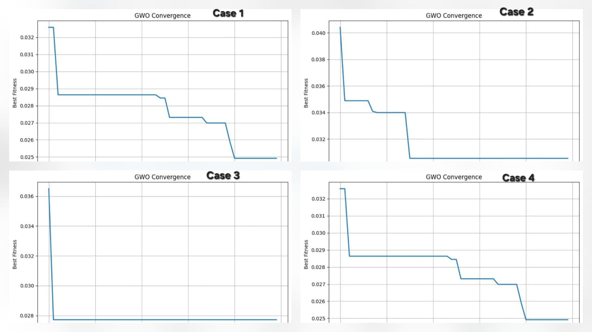

# Flowchart Sistem

# 1 Eksperimen Optimasi XGBoost dengan Grey Wolf Optimizer (GWO)

Dokumen ini menjelaskan konfigurasi parameter, hasil eksperimen, perilaku konvergensi, serta analisis hubungan antara **ruang pencarian hyperparameter** dan **kinerja model** pada setiap skenario pengujian.

---

## 2 Parameter Percobaan

Tabel berikut menunjukkan **rentang hyperparameter** yang digunakan oleh GWO pada setiap kasus. Perbedaan rentang ini bertujuan untuk menguji sensitivitas GWO terhadap konfigurasi awal dan luas ruang pencarian.

### Tabel Parameter Pengujian

| Case | Parameter | Lower Bound | Upper Bound |
|-----:|-----------|------------:|------------:|
| 1 | n_estimators | 50 | 300 |
| 1 | max_depth | 2 | 8 |
| 1 | learning_rate | 0.01 | 0.30 |
| 1 | subsample | 0.60 | 1.00 |
| 1 | colsample_bytree | 0.60 | 1.00 |
| 2 | n_estimators | 100 | 400 |
| 2 | max_depth | 3 | 10 |
| 2 | learning_rate | 0.01 | 0.20 |
| 2 | subsample | 0.70 | 1.00 |
| 2 | colsample_bytree | 0.60 | 0.90 |
| 3 | n_estimators | 30 | 200 |
| 3 | max_depth | 2 | 6 |
| 3 | learning_rate | 0.05 | 0.25 |
| 3 | subsample | 0.50 | 0.90 |
| 3 | colsample_bytree | 0.50 | 0.80 |
| 4 | n_estimators | 150 | 350 |
| 4 | max_depth | 4 | 8 |
| 4 | learning_rate | 0.01 | 0.15 |
| 4 | subsample | 0.60 | 0.95 |
| 4 | colsample_bytree | 0.60 | 1.00 |

---

## 3 Hasil Eksperimen

Ringkasan performa antara **XGBoost baseline** dan **XGBoost + GWO** ditunjukkan pada tabel berikut.

| Case | Model | Accuracy | Precision | Recall | F1-score | AUC |
|-----:|-------|----------|-----------|--------|----------|-----|
| 1 | Baseline XGBoost | 0.9649 | 0.9524 | 0.9524 | 0.9524 | 0.9623 |
|   | **XGBoost + GWO** | **0.9825** | **0.9762** | **0.9762** | **0.9762** | **0.9812** |
| 2 | **Baseline XGBoost** | **0.9825** | **0.9762** | **0.9762** | **0.9762** | **0.9812** |
|   | XGBoost + GWO | 0.9649 | 0.9318 | 0.9762 | 0.9535 | 0.9673 |
| 3 | Baseline XGBoost | 0.9561 | 0.9111 | 0.9762 | 0.9425 | 0.9603 |
|   | **XGBoost + GWO** | **0.9825** | **0.9762** | **0.9762** | **0.9762** | **0.9812** |
| 4 | **Baseline XGBoost** | **0.9737** | **0.9756** | 0.9524 | **0.9639** | **0.9692** |
|   | XGBoost + GWO | 0.9649 | 0.9524 | 0.9524 | 0.9524 | 0.9623 |

---

## 4 Kurva Konvergensi GWO

Grafik berikut memperlihatkan perilaku konvergensi GWO pada setiap kasus.

---

## 5 Analisis per Kasus

### Case 1
- **Ruang pencarian seimbang** (cukup luas namun tidak ekstrem).
- Baseline belum optimal → GWO mampu mengeksplorasi dan mengeksploitasi dengan baik.
- Penurunan `max_depth` dan penyesuaian `learning_rate` menghasilkan generalisasi lebih baik.
- **Hasil**: peningkatan signifikan pada semua metrik.

### Case 2
- Rentang parameter relatif **sempit dan konservatif**.
- Baseline sudah mendekati optimal sejak awal.
- GWO cepat konvergen → eksplorasi terbatas (*premature convergence*).
- **Hasil**: performa GWO lebih rendah dari baseline.

### Case 3
- Baseline memiliki performa terendah.
- Rentang parameter kecil namun fleksibel → memudahkan GWO menemukan solusi optimal.
- Konvergensi sangat cepat dan stabil.
- **Hasil**: peningkatan performa paling signifikan.

### Case 4
- Rentang `n_estimators` dan `max_depth` relatif tinggi.
- Model baseline sudah cukup kompleks dan stabil.
- GWO terus menurunkan fitness, tetapi tidak menghasilkan konfigurasi yang lebih general.
- **Hasil**: baseline tetap unggul.

---

## 6 Kesimpulan

- GWO **efektif ketika baseline belum optimal** dan ruang pencarian dirancang dengan baik (Case 1 dan 3).
- Jika baseline sudah kuat, optimasi metaheuristik **tidak menjamin peningkatan performa** (Case 2 dan 4).
- Desain **rentang hyperparameter** memiliki dampak langsung terhadap keberhasilan optimasi.
- Fitness yang menurun **tidak selalu berbanding lurus** dengan peningkatan metrik klasifikasi.

---

